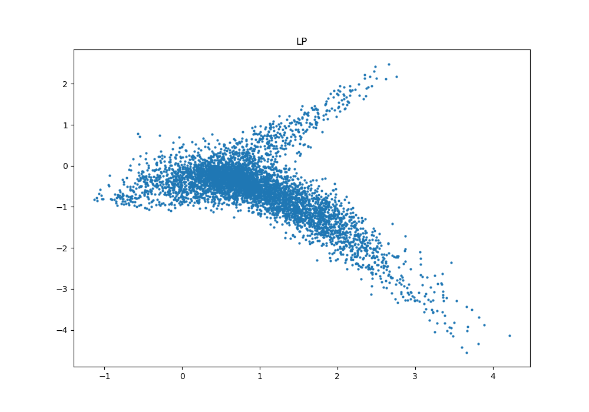
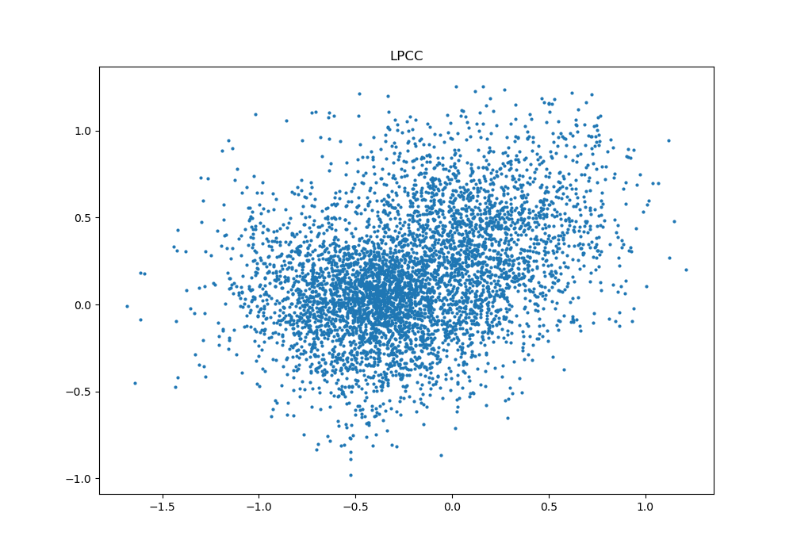
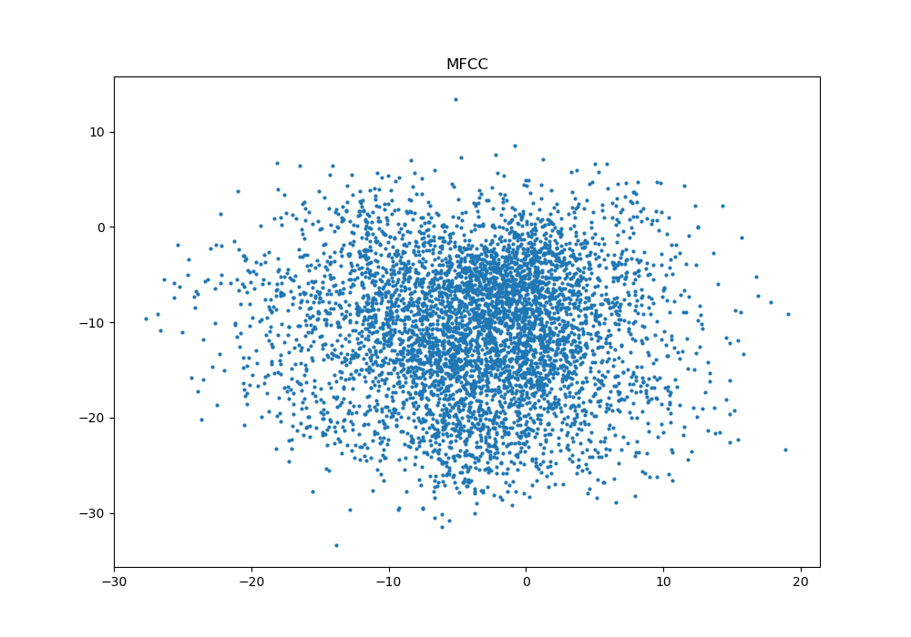
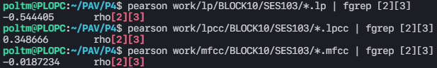
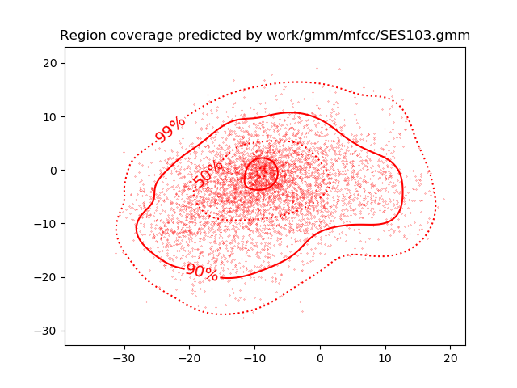
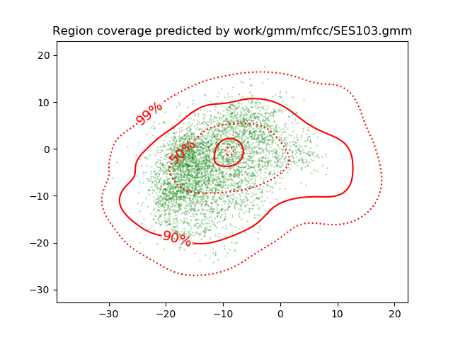
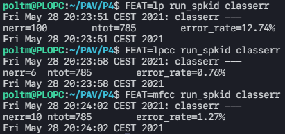
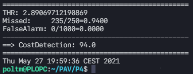
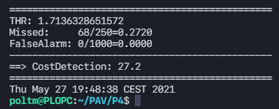
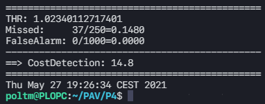

PAV - P4: reconocimiento y verificación del locutor
===================================================


### SPTK, Sox y los scripts de extracción de características.

- Analice el script `wav2lp.sh` y explique la misión de los distintos comandos involucrados en el *pipeline*
  principal (`sox`, `$X2X`, `$FRAME`, `$WINDOW` y `$LPC`). Explique el significado de cada una de las 
  opciones empleadas y de sus valores.

  > 
  >```bash
  >sox $inputfile -t raw -e signed -b 16 - | $X2X +sf | $FRAME -l 240 -p 80 | $WINDOW -l 240 -L 240 | $LPC -l 240 -m $lpc_order > $base.lp
  >```
  >
  >**sox**: Es un programa que sirve para generar una señal del formato adecuado a partir de una señal con otro formato. También se suele usar para convertir la frecuencia de muestreo de un archivo de audio de un valor a otro. La opción **-t** se usa para indicar el tipo de archivo de audio usado. **-e** sirve para indicar el tipo de codificación y **-b** para establecer el tamaño de muestras codificadas en bits.
  >
  >**$X2X (sptk x2x)**: Es el programa de SPTK que permite la conversión entre distintos formatos de datos. La opción **+sf** indica el formato del input como short y el output como float.
  >
  >**$FRAME (sptk frame)**: Es un programa al que se le entrega una señal y te devuelve a la salida los mismos datos divididos en tramas de **-l** muestras tomadas con un desplazamiento de **-p** muestras.
  >
  >**$WINDOW (sptk window)**: Este programa multiplica los L vectores de entrada de un archivo por una determinada ventana. **-l** indica el tamaño de muestras del input (menor o igual a 2048), y **-L** la cantidad de muestras del output.
  >
  >**$LPC (sptk lpc)**: Es el programa que calcula los coeficientes de predicción lineal de orden **-m** de una trama de tamaño **-l**.

- Explique el procedimiento seguido para obtener un fichero de formato *fmatrix* a partir de los ficheros de salida de SPTK (líneas 45 a 47 del script `wav2lp.sh`).

  >```bash
  >ncol=$((lpc_order+1)) # lpc p =>  (gain a1 a2 ... ap) 
  >nrow=`$X2X +fa < $base.lp | wc -l | perl -ne 'print $_/'$ncol', "\n";'`
  >```
  >Primero se establece el valor del número de columnas de la fmatrix, que equivale al orden de la codificación de predicción lineal más 1, porque en el primer elemento del vector se encuentra la ganancia de la señal en cuestión. 
  >
  >El procedimiento para encontrar el número de filas depende de la longitud de la señal, la longitud y desplazamiento de la ventana por lo que es mejor extraer esa información del fichero obtenido en el comando de la pregunta anterior. Con **sptk x2x +fa** cambiamos de float a ASCII, con **wc -l** contamos el número de lineas y con perl imprimimos las lineas con el formato fmatrix. 

  * ¿Por qué es conveniente usar este formato (u otro parecido)? Tenga en cuenta cuál es el formato de entrada y cuál es el de resultado.
    >
    >Usar este formato es útil para ver más intuitivamente los contenidos del archivo, a parte de poder seleccionar filas o columnas de la matriz para escoger coeficientes o tramas del codificador de predicción lineal.

- Escriba el *pipeline* principal usado para calcular los coeficientes cepstrales de predicción lineal (LPCC) en su fichero <code>scripts/wav2lpcc.sh</code>:

  >```bash
  >sox $inputfile -t raw -e signed -b 16 - | $X2X +sf | $FRAME -l 240 -p 80 | $WINDOW -l 240 -L 240 | $LPC -l 240 -m $lpc_order | $LPC2C -m $lpc_order -M $cepstrum_order > $base.lpcc
  >```
  > El programa LPC2C transforma los coeficientes de predicción lineal a coeficientes cepstrales de predicción lineal, con el mismo orden LPC y el orden de cepstrum pasado por parámetro de wav2lp. Finalmente la salida se escribe en el archivo **base.lpcc**.

- Escriba el *pipeline* principal usado para calcular los coeficientes cepstrales en escala Mel (MFCC) en su
  fichero <code>scripts/wav2mfcc.sh</code>:
  
  >```bash
  >sox $inputfile -t raw -e signed -b 16 - | $X2X +sf | $FRAME -l 240 -p 80 | $WINDOW -l 240 -L 240 | $MFCC -l 240 -w 1 -s 8.0 -m $mfcc_order -n $mel_filter_order > $base.mfcc
  >```
  > En este comando en vez de utilizar el **sptk lp** usamos el **sptk mfcc** que calcula el mel-frequency cepstrum pasando como parámetros el orden de mfcc, el orden del banco de filtros, frecuencia de muestreo (**-s** 8KHz), tamaño de la trama (**-l**) e indicando el tipo de ventana a usar (**-w 1** ⇒ Rectangular).

### Extracción de características.

- Inserte una imagen mostrando la dependencia entre los coeficientes 2 y 3 de las tres parametrizaciones para todas las señales de un locutor.

  >Como podemos ver en la siguiente linea de código perteneciente al script `wav2lp.sh`, la segunda columna generada en las parametrizaciones es la ganancia (la primera corresponde a un contador). Por lo que los coeficientes 2 y 3 corresponden a las columnas 4 y 5 respectivamente:
  >```bash 
  >ncol=$((lpc_order+1)) # lpc p =>  (gain a1 a2 ... ap) 
  >```
  >**LP**
  >```bash 
  >$ fmatrix_show work/lp/BLOCK10/SES103/*.lp | egrep '^\[' | cut -f4,5 > lp_2_3.txt
  >```
  >**LPCC**
  >```bash 
  >$ fmatrix_show work/lpcc/BLOCK10/SES103/*.lpcc | egrep '^\[' | cut -f4,5 > lpcc_2_3.txt
  >```
  >**MFCC**
  >```bash 
  >$ fmatrix_show work/mfcc/BLOCK10/SES103/*.mfcc | egrep '^\[' | cut -f4,5 > mfcc_2_3.txt
  >```
  >Para generar los plots hemos creado el siguiente script de python que coge como argumento los features a generar:
  >```python
  >import matplotlib.pyplot as plt
  >import sys
  >
  >if len( sys.argv ) < 2:
  >    print("Invalid Args!")
  >    sys.exit()
  >
  >for feat in sys.argv[1:]:
  >    fdata = open(feat + '_2_3.txt', 'r')
  >    x_data = []                
  >    y_data = []               
  >    lines = fdata.readlines() 
  >
  >    for line in lines:
  >        x, y = line.split()     
  >        x_data.append(float(x))
  >        y_data.append(float(y))
  >
  >    fdata.close()
  >    plt.figure(figsize=(10,7))
  >    plt.title(feat.upper())
  >    plt.plot(x_data,y_data,'o',markersize=2)
  >    plt.savefig("./assets/" + feat + "-feature-plot.png")
  >```
  >```bash
  >$ python3 scripts/plot_features.py lp lpcc mfcc
  >```
  >
  >
  >
  >
  >
  >
  
  + ¿Cuál de ellas le parece que contiene más información?
  >El caso que contenga más información será aquel en el que se aprecie una mayor incorrelación entre los coeficientes encontrados, ya que se estará valorando un rango de información mayor y depreciando la información redundante. Si nos fijamos en cual de las tres imagenes tiene los coeficientes más incorrelados, y en consecuencia, más dispersos, seleccionaríamos el caso del MFCC, ya que el rango abarcado es mucho mayor que el de LP y LPCC. 

- Usando el programa <code>pearson</code>, obtenga los coeficientes de correlación normalizada entre los
  parámetros 2 y 3 para un locutor, y rellene la tabla siguiente con los valores obtenidos.>

  >
  >
  >|                        | LP   | LPCC | MFCC |
  >|------------------------|:----:|:----:|:----:|
  >| &rho;<sub>x</sub>[2,3] |  -0.511105    |   0.348666   |   -0.0187234   |
  
  + Compare los resultados de <code>pearson</code> con los obtenidos gráficamente.
  >Anteriormente, en el análisis gráfico, hemos visto que el mejor de los tres casos era el MFCC, seguido del LPCC y el LP. Con los resultados obtenidos con <code>pearson</code> podemos confirmar esta tesis ya que, cuanto más se acerque a 1 el valor absoluto de los coeficientes de correlación normalizada obtenidos más correlados estarán los coeficientes. El caso más lejano a 1 es el de MFCC, seguido del LPCC y el LP, que coincide con los resultados que habíamos obtenido anteriormente, y confirma que nuestro programa tiene un funcionamiento muy positivo con los coeficientes MFCC.
  
- Según la teoría, ¿qué parámetros considera adecuados para el cálculo de los coeficientes LPCC y MFCC?

>**LPCC**
>+ Orden de LPC: 8
>+ Orden del cepstrum: 13
>
>**MFCC**
>+ Orden de MFCC: 13
>+ Número de filtros: 24-40
>
>Los valores que nos han proporcionado un mejor resultado son los siguientes:
>```bash
> wav2lpcc 19 26 $db/$filename.wav $w/$FEAT/$filename.$FEAT
>
> wav2mfcc 13 24 $dir_db/$filename.wav $w/$FEAT/$filename.$FEAT
>```

### Entrenamiento y visualización de los GMM.

Complete el código necesario para entrenar modelos GMM.

- Inserte una gráfica que muestre la función de densidad de probabilidad modelada por el GMM de un locutor
  para sus dos primeros coeficientes de MFCC.

>```bash
>plot_gmm_feat work/gmm/mfcc/SES103.gmm work/mfcc/BLOCK10/SES103/SA103S* -x1 -y2 -p 99,90,50,10,1
>```
>
  
- Inserte una gráfica que permita comparar los modelos y poblaciones de dos locutores distintos (la gŕafica
  de la página 20 del enunciado puede servirle de referencia del resultado deseado). Analice la capacidad
  del modelado GMM para diferenciar las señales de uno y otro.

>Comparamos el modelo del apartado anterior, del locutor SES10, con el locutor SES00:
>```bash
>plot_gmm_feat work/gmm/mfcc/SES103.gmm work/mfcc/BLOCK00/SES000/SA000S* -x1 -y2 -p 99,90,50,10,1 -fgreen
>```
>

### Reconocimiento del locutor.

Complete el código necesario para realizar reconociminto del locutor y optimice sus parámetros.

- Inserte una tabla con la tasa de error obtenida en el reconocimiento de los locutores de la base de datos
  SPEECON usando su mejor sistema de reconocimiento para los parámetros LP, LPCC y MFCC.

  >
  >
   >|                        | LP   | LPCC | MFCC |
  >|------------------------|:----:|:----:|:----:|
  >| Número de Errores |   100  |    6  |   10   |
  >| Tasa de Error |   12.74%   |    0.76%  |   1.27%   |


### Verificación del locutor.

Complete el código necesario para realizar verificación del locutor y optimice sus parámetros.

- Inserte una tabla con el *score* obtenido con su mejor sistema de verificación del locutor en la tarea
  de verificación de SPEECON. La tabla debe incluir el umbral óptimo, el número de falsas alarmas y de
  pérdidas, y el score obtenido usando la parametrización que mejor resultado le hubiera dado en la tarea
  de reconocimiento.

  >**LP**
  >
  >
  >
  >**LPCC**
  >
  >
  >
  >**MFCC**
  >
  >
  >
  >|                        | LP   | LPCC | MFCC |
  >|------------------------|:----:|:----:|:----:|
  >| Umbral Óptimo |   2.89069712190869  |    1.7136328651572  |   1.02340112717401   |
  >| Pérdidas |   235/250   |    68/250  |   37/250   |
  >| Falsas Alarmas |   0/1000   |    0/1000  |   0/1000   |
  >| **Coste de detección** |   **94.0**  |    **27.2**  |   **14.8**   |
 
### Test final

- Adjunte, en el repositorio de la práctica, los ficheros `class_test.log` y `verif_test.log` 
  correspondientes a la evaluación *ciega* final.

### Trabajo de ampliación.

- Recuerde enviar a Atenea un fichero en formato zip o tgz con la memoria (en formato PDF) con el trabajo 
  realizado como ampliación, así como los ficheros `class_ampl.log` y/o `verif_ampl.log`, obtenidos como 
  resultado del mismo.
