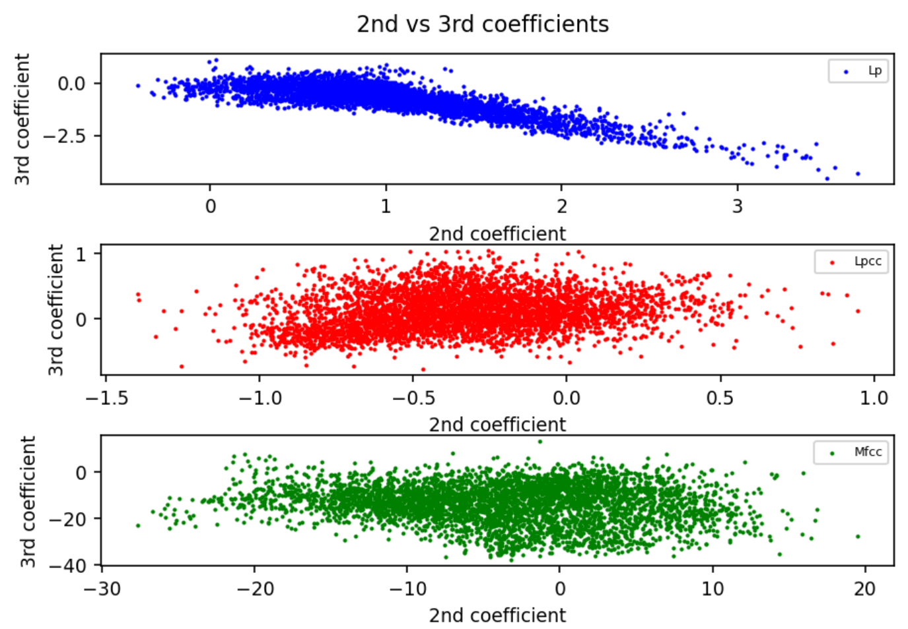

PAV - P4: reconocimiento y verificación del locutor
===================================================

Obtenga su copia del repositorio de la práctica accediendo a [Práctica 4](https://github.com/albino-pav/P4)
y pulsando sobre el botón `Fork` situado en la esquina superior derecha. A continuación, siga las
instrucciones de la [Práctica 2](https://github.com/albino-pav/P2) para crear una rama con el apellido de
los integrantes del grupo de prácticas, dar de alta al resto de integrantes como colaboradores del proyecto
y crear la copias locales del repositorio.

También debe descomprimir, en el directorio `PAV/P4`, el fichero [db_8mu.tgz](https://atenea.upc.edu/pluginfile.php/3145524/mod_assign/introattachment/0/spk_8mu.tgz?forcedownload=1)
con la base de datos oral que se utilizará en la parte experimental de la práctica.

Como entrega deberá realizar un *pull request* con el contenido de su copia del repositorio. Recuerde
que los ficheros entregados deberán estar en condiciones de ser ejecutados con sólo ejecutar:

~~~~~~~~~~~~~~~~~~~~~~~~~~~~~~~~~~~~~~~~~~~~~~~~~~~~~.sh
  make release
  run_spkid mfcc train test classerr verify verifyerr
~~~~~~~~~~~~~~~~~~~~~~~~~~~~~~~~~~~~~~~~~~~~~~~~~~~~~

Recuerde que, además de los trabajos indicados en esta parte básica, también deberá realizar un proyecto
de ampliación, del cual deberá subir una memoria explicativa a Atenea y los ficheros correspondientes al
repositorio de la práctica.

A modo de memoria de la parte básica, complete, en este mismo documento y usando el formato *markdown*, los
ejercicios indicados.

## Ejercicios.

### SPTK, Sox y los scripts de extracción de características.

- Analice el script `wav2lp.sh` y explique la misión de los distintos comandos involucrados en el *pipeline*
  principal (`sox`, `$X2X`, `$FRAME`, `$WINDOW` y `$LPC`). Explique el significado de cada una de las 
  opciones empleadas y de sus valores.

El pipeline principal es:  
``` bash
sox $inputfile -t raw -e signed -b 16 - | $X2X +sf | $FRAME -l 240 -p 80 | $WINDOW -l 240 -L 240 |
$LPC -l 240 -m $lpc_order > $base.lp
```
En primer lugar, se usa sox para convertir un señal ``inputfile`` (en este caso, en formato .wav) a tipo raw (sin headers) con ``-t raw``. Además, se usa una codificación con signo ``-e signed`` y cada muestra está cuantificada con 16 bits ``-b 16``. Esta conversión a raw es necesaria porque ``sptk`` trabaja directamente sobre el fichero de entrada sin diferenciar contenido de cabeceras o de datos, motivo por el cual hemos de eliminar la parte de cabeceras antes de tratarlo en ``sptk``.

Hecho esto, se usa un conjunto de comandos para tratar estos datos con SPTK. Lo primero es usar ``x2x`` para convertir los datos de short con signo a float ``+sf``. A continuación, entramamos la señal usando el comando ``frame`` con un tamaño de trama de 240 muestras/30 ms (``-l 240``) y un desplazamiento entre frames de 80 muestras (``-p 80``). Luego, se enventana la señal (``window``) indicando el tamaño de frame de la entrada (``-l 240``) y el de la salida, que es el mismo (``-L 240``). Al no estar indicando qué tipo de ventana queremos usar, por defecto sptk usa la ventana de *Blackman*. 

Una vez ya hemos entramado y enventanado la señal, solo queda obtener los coeficientes LPC, lo cual se hace con el comando ``lpc``. Se ha de indicar el tamaño de frame de entrada (``-l 240``) y el orden del lpc ``-m``, el cual en este caso lo indica el usuario. Este resultado se guarda en un fichero temporal ``$base.lp``.


- Explique el procedimiento seguido para obtener un fichero de formato *fmatrix* a partir de los ficheros de
  salida de SPTK (líneas 45 a 47 del script `wav2lp.sh`).

Las líneas donde se obtiene en formato *fmatrix* son:

``` bash
# Our array files need a header with the number of cols and rows:
ncol=$((lpc_order+1)) # lpc p =>  (gain a1 a2 ... ap) 
nrow=`$X2X +fa < $base.lp | wc -l | perl -ne 'print $_/'$ncol', "\n";'`

# Build fmatrix file by placing nrow and ncol in front, and the data after them
echo $nrow $ncol | $X2X +aI > $outputfile
```
Por un lado, la primera casilla de nuestro fichero será el número del coeficiente, el cual será el orden del lpc ``lpc_order`` + 1, ya que el primer elemento es la ganancia, no el primer coeficiente. Por otro lado, para las columnas hemos de convertir lo que hemos generado en el apartado anterior de float a ascii ``sptk x2x -af`` y lo hemos separado en diferentes líneas con wc

  * ¿Por qué es conveniente usar este formato (u otro parecido)? Tenga en cuenta cuál es el formato de
    entrada y cuál es el de resultado.

  Si está en *fmatrix* podemos ver los contenidos en ascii usando ``fmatrix_show``. El fichero que tenemos de entrada es un conjunto de floats concatenados, los cuales no podemos interpretar directamente, ya que no están en ascii. Gracias al formato *fmatrix* podemos además guardarnos los datos por filas o columnas combinando ``fmatrix_show`` y ``cut`` en un fichero de texto y que estén en un formato legible.

- Escriba el *pipeline* principal usado para calcular los coeficientes cepstrales de predicción lineal
  (LPCC) en su fichero <code>scripts/wav2lpcc.sh</code>:

``` bash
sox $inputfile -t raw -e signed -b 16 - | $X2X +sf | $FRAME -l 240 -p 80 | $WINDOW -l 240 -L 240 | $LPC -l 240 -m $lpc_order | $LPCC -m $lpc_order -M $lpcc_order > $base.lp
```

- Escriba el *pipeline* principal usado para calcular los coeficientes cepstrales en escala Mel (MFCC) en su
  fichero <code>scripts/wav2mfcc.sh</code>:

```bash
sox $inputfile -t raw -e signed -b 16 - | $X2X +sf | $FRAME -l 240 -p 80 | $WINDOW -l 240 -L 240 | $MFCC -s 8 -l 240 -m $mfcc_order -n $filter_bank_order > $base.mfcc
```

### Extracción de características.

- Inserte una imagen mostrando la dependencia entre los coeficientes 2 y 3 de las tres parametrizaciones
  para todas las señales de un locutor.
  
   <p align="center">
   
   </p>

  + Indique **todas** las órdenes necesarias para obtener las gráficas a partir de las señales 
    parametrizadas.

  Debido al formato que se decide en ``wav2lp.sh``, la primera columna no nos proporciona información de los coeficientes, ya que es un contador. Además, hemos de tener en cuenta que la primera posición de datos, en el caso del LP y lpcc corresponde a la ganancia, con lo que nos quedaremos con la cuarta (segundo coeficiente) y quinta (tercer coeficiente) posición:

  ```bash
  fmatrix_show work/lp/BLOCK00/SES000/*.lp | egrep '^\[' | cut -f4,5 > lp_2_3.txt
  fmatrix_show work/lpcc/BLOCK00/SES000/*.lpcc | egrep '^\[' | cut -f4,5 > lpcc_2_3.txt
  fmatrix_show work/mfcc/BLOCK00/SES000/*.mfcc | egrep '^\[' | cut -f4,5 > mfcc_2_3.txt
  ```
  + ¿Cuál de ellas le parece que contiene más información?

- Usando el programa <code>pearson</code>, obtenga los coeficientes de correlación normalizada entre los
  parámetros 2 y 3 para un locutor, y rellene la tabla siguiente con los valores obtenidos.

  |                        | LP   | LPCC | MFCC |
  |------------------------|:-----------------:|:-----------------:|:-----------------:|
  | &rho;<sub>x</sub>[2,3] | -0.818326 |0.217792|-0.134221|

  
  + Compare los resultados de <code>pearson</code> con los obtenidos gráficamente.
  
  Vemos que en la gráfica la relación entre los coeficientes, en el caso LP se dispersan de una manera más o menos lineal. Es decir, al coeficiente 3 le corresponden valores bastante similares al coeficiente 2 según vamos variando su valor. Por otro lado, que en los otros dos casos los coeficientes siguen una distribución más dispersa, con lo que podemos deducir que estos últimos están menos correlados que los lpc.

  Los resultados obtenidos con *Pearson* nos llevan a la misma conclusión: El coeficiente LPC toma valores próximos a 1 (alta correlación normalizada), mientras que los LPCC y MFCC están más próximos a 0 (baja correlación normalizada). 
  
  En resumen, los MFCC son los que tienen más información entre coeficientes, seguidos de cerca por los LPCC.


- Según la teoría, ¿qué parámetros considera adecuados para el cálculo de los coeficientes LPCC y MFCC?

  Para los LPCC:
    + Orden del LPCC: **13-16**

  Para los MFCC:
    + Número de filtros: **24-40**
    + Número de coeficientes: **13**

### Entrenamiento y visualización de los GMM.

Complete el código necesario para entrenar modelos GMM.

- Inserte una gráfica que muestre la función de densidad de probabilidad modelada por el GMM de un locutor
  para sus dos primeros coeficientes de MFCC.
  
- Inserte una gráfica que permita comparar los modelos y poblaciones de dos locutores distintos (la gŕafica
  de la página 20 del enunciado puede servirle de referencia del resultado deseado). Analice la capacidad
  del modelado GMM para diferenciar las señales de uno y otro.

### Reconocimiento del locutor.

Complete el código necesario para realizar reconociminto del locutor y optimice sus parámetros.

- Inserte una tabla con la tasa de error obtenida en el reconocimiento de los locutores de la base de datos
  SPEECON usando su mejor sistema de reconocimiento para los parámetros LP, LPCC y MFCC.

### Verificación del locutor.

Complete el código necesario para realizar verificación del locutor y optimice sus parámetros.

- Inserte una tabla con el *score* obtenido con su mejor sistema de verificación del locutor en la tarea
  de verificación de SPEECON. La tabla debe incluir el umbral óptimo, el número de falsas alarmas y de
  pérdidas, y el score obtenido usando la parametrización que mejor resultado le hubiera dado en la tarea
  de reconocimiento.
 
### Test final

- Adjunte, en el repositorio de la práctica, los ficheros `class_test.log` y `verif_test.log` 
  correspondientes a la evaluación *ciega* final.

### Trabajo de ampliación.

- Recuerde enviar a Atenea un fichero en formato zip o tgz con la memoria (en formato PDF) con el trabajo 
  realizado como ampliación, así como los ficheros `class_ampl.log` y/o `verif_ampl.log`, obtenidos como 
  resultado del mismo.
