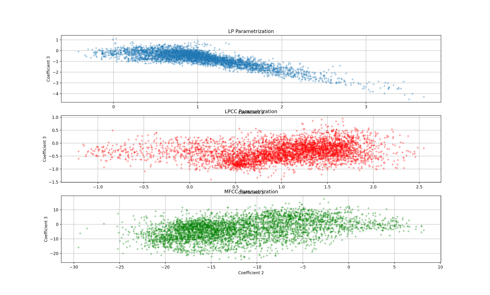
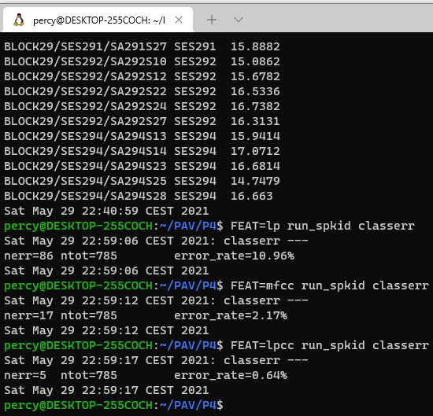
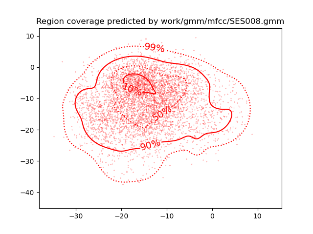
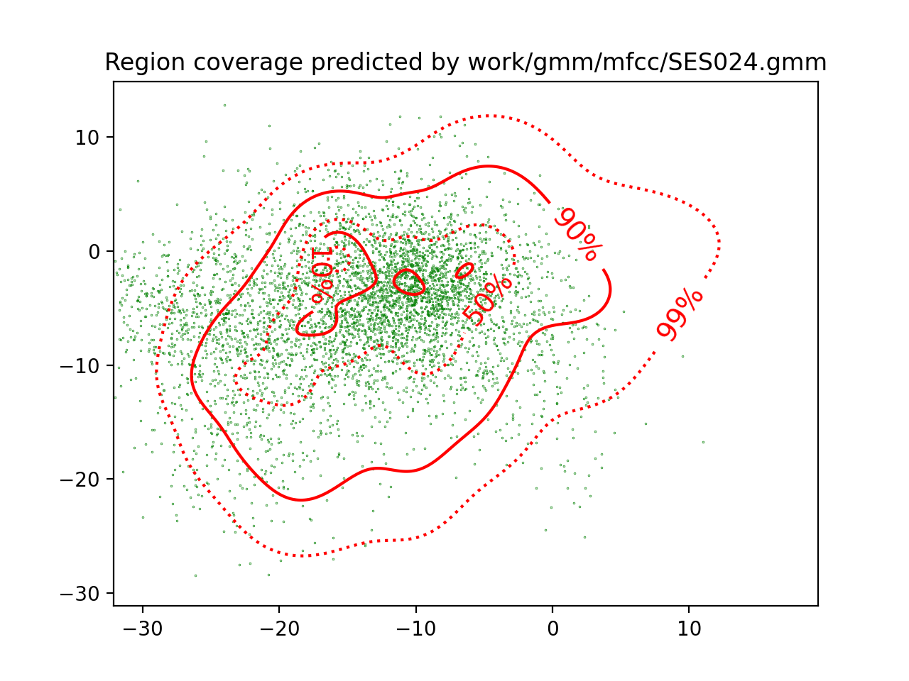
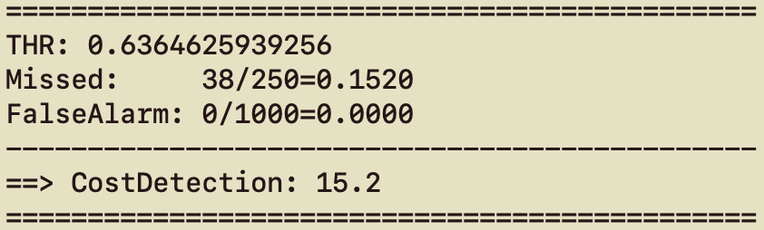

PAV - P4: reconocimiento y verificación del locutor
===================================================

Obtenga su copia del repositorio de la práctica accediendo a [Práctica 4](https://github.com/albino-pav/P4)
y pulsando sobre el botón `Fork` situado en la esquina superior derecha. A continuación, siga las
instrucciones de la [Práctica 2](https://github.com/albino-pav/P2) para crear una rama con el apellido de
los integrantes del grupo de prácticas, dar de alta al resto de integrantes como colaboradores del proyecto
y crear la copias locales del repositorio.

También debe descomprimir, en el directorio `PAV/P4`, el fichero [db_8mu.tgz](https://atenea.upc.edu/pluginfile.php/3145524/mod_assign/introattachment/0/spk_8mu.tgz?forcedownload=1)
con la base de datos oral que se utilizará en la parte experimental de la práctica.

Como entrega deberá realizar un *pull request* con el contenido de su copia del repositorio. Recuerde
que los ficheros entregados deberán estar en condiciones de ser ejecutados con sólo ejecutar:

~~~~~~~~~~~~~~~~~~~~~~~~~~~~~~~~~~~~~~~~~~~~~~~~~~~~~.sh
  make release
  run_spkid mfcc train test classerr verify verifyerr
~~~~~~~~~~~~~~~~~~~~~~~~~~~~~~~~~~~~~~~~~~~~~~~~~~~~~

Recuerde que, además de los trabajos indicados en esta parte básica, también deberá realizar un proyecto
de ampliación, del cual deberá subir una memoria explicativa a Atenea y los ficheros correspondientes al
repositorio de la práctica.

A modo de memoria de la parte básica, complete, en este mismo documento y usando el formato *markdown*, los
ejercicios indicados.

## Ejercicios.

### SPTK, Sox y los scripts de extracción de características.

- Analice el script `wav2lp.sh` y explique la misión de los distintos comandos involucrados en el *pipeline*
  principal (`sox`, `$X2X`, `$FRAME`, `$WINDOW` y `$LPC`). Explique el significado de cada una de las 
  opciones empleadas y de sus valores.

  ```c
  $ sox $inputfile -t raw -e signed -b 16 - | $X2X +sf | $FRAME -l 240 -p 80 | $WINDOW -l 240 -L 240 | $LPC -l 240 -m $lpc_order > $base.lp
  ```
  > **sox**: es un programa multifuncional, donde podemos generar una señal del formato deseado a partir de un fichero de entrada. Además, permite modificar la frecuencia de muestreo. **-t** sirve para indicar el formato de audio; **-e** el tipo de dato en la codificación; y **-b** se usa para indicar cuantos bits se usan por muestra.
  >
  > **$X2X (x2x)**: es un programa de SPTK, el cual nos permite la conversión del formato de datos. Con la opción **+sf** indicamos que el input format es short y el de output es float.
  >
  > **$FRAME (frame)**: programa de SPTK, el cual separa la señal de entrada en un cierto número y formato de tramas, especificando con **-l** el número de muestras por trama y con **-p** sus respectivos solapamientos.
  >
  > **$WINDOW (window)**: programa de SPTK, el cual multiplica las **-l** muestras por una ventana Blackman, y saca **-L** muestras en el output.
  >
  > **$LPC (lpc)**: programa de SPTK, el cual calcula los **-m** coeficientes de predicción lineal de **-l** muestras enventanadas.

- Explique el procedimiento seguido para obtener un fichero de formato *fmatrix* a partir de los ficheros de
  salida de SPTK (líneas 45 a 47 del script `wav2lp.sh`).
  ```c
  ncol=$((lpc_order+1)) # lpcc p =>  (c0 c1 ... cp) 
  nrow=`$X2X +fa < $base.lpcc | wc -l | perl -ne 'print $_/'$ncol', "\n";'`
  ```
  > En número de columnas del formato fmatrix viene marcado por el número de coeficientes más otra columna donde se indica el el valor de ganancia. 

  > Para encontrar el número de filas necesarias depende de la duración de la señal y de la longitud y desplazamiento de la ventana. Entonces se opta por extraer este valor del fichero obtenido (base.lp). Se cambia de float a ascii con el comando **x2x +fa**, seguidamente, con **wc -l** se cuenta el número de filas y con **perl** se imprimen las lineas con el formato de fmatrix.
  >

  * ¿Por qué es conveniente usar este formato (u otro parecido)? Tenga en cuenta cuál es el formato de
    entrada y cuál es el de resultado.
    > Es conveniente ya que se presentan los datos de una forma más visual; además, se pueden seleccionar los coeficientes fácilmente ya que están ordenados en tramas y en columnas correspondientes a estos mismos, a los coeficientes.

- Escriba el *pipeline* principal usado para calcular los coeficientes cepstrales de predicción lineal
  (LPCC) en su fichero <code>scripts/wav2lpcc.sh</code>:

  ```c
  sox $inputfile -t raw -e signed -b 16 - | $X2X +sf | $FRAME -l 240 -p 80 | $WINDOW -l 240 -L 240 |
	$LPC -l 240 -m $lpc_order | $LPCC -m $lpc_order -M $lpcc_order  > $base.lpcc
  ```
  > El programa **$LPCC (lpc2c)** se encarga de transformar los **-m** coeficientes de predicción lineal a **-M** coeficientes cepstrales de predicción lineal.
  >

- Escriba el *pipeline* principal usado para calcular los coeficientes cepstrales en escala Mel (MFCC) en su
  fichero <code>scripts/wav2mfcc.sh</code>:

  ```c
  sox $inputfile -t raw -e signed -b 16 - | $X2X +sf | $FRAME -l 240 -p 80 | $WINDOW -l 240 -L 240 |
	$MFCC -l 240 -m $mfcc_order -s 8 -w 1 -n 28 > $base.mfcc
  ```
  > En este caso, ya no se usa los coeficientes de predicción lineal, sino que se ha sustituido por el uso del mel-cepstrum mediante **$MFCC (mfcc)**, donde se especifica con **-l** la longitud de las tramas, con **-m** el orden del mel-cepstrum, con **-s** la frecuencia de muestreo, con **-w** se le indica que no use ninguna ventana (ya que previamente ya se le aplica una), y con **-n** se le indica el número de filtros del banco.

### Extracción de características.

- Inserte una imagen mostrando la dependencia entre los coeficientes 2 y 3 de las tres parametrizaciones
  para todas las señales de un locutor.

  > 
  
  + Indique **todas** las órdenes necesarias para obtener las gráficas a partir de las señales 
    parametrizadas.
    > Hemos observado que con el formato fmatrix, los coeficientes 2 y 3 corresponden con las columnas 4 y 5 en el caso de <code>wav2lp.sh</code> . Esto es debido a que primero hay un contador del numero de trama y además, el primer coeficiente es el de ganancia de los coeficientes.
    >
    > En el caso de <code>wav2lpcc.sh</code> y <code>wav2mfcc.sh</code>, no existe este término de ganancia, por lo tanto, los coeficientes 2 y 3 corresponden con el 3 y 4.
    > 
    > **LP**

    ```c
    $ fmatrix_show work/lp/BLOCK00/SES000/*.lp | egrep '^\[' | cut -f4,5 > lp_2_3.txt
    ```
    >
    > **LPCC**
    ```c
    $ fmatrix_show work/lpcc/BLOCK00/SES000/*.lpcc | egrep '^\[' | cut -f3,4 > lpcc_2_3.txt
    ```
    > 
    > **MFCC**
    >
    ```c
    $ fmatrix_show work/mfcc/BLOCK00/SES000/*.mfcc | egrep '^\[' | cut -f3,4 > mfcc_2_3.txt
    ```
    >
    > Se ha generado el siguiente script de python para representar la figura presentada:

    ```c
    import numpy as np
    import matplotlib.pyplot as plt

    arxiu = []
    arxiu1='lp_2_3.txt'
    arxiu2='lpcc_2_3.txt'
    arxiu3='mfcc_2_3.txt'

    lp_2 = np.loadtxt(arxiu1, skiprows=0, usecols=0)
    lp_3 = np.loadtxt(arxiu1, skiprows=0, usecols=1)
    lpcc_2 = np.loadtxt(arxiu2, skiprows=0, usecols=0)
    lpcc_3 = np.loadtxt(arxiu2, skiprows=0, usecols=1)
    mfcc_2 = np.loadtxt(arxiu3, skiprows=0, usecols=0)
    mfcc_3 = np.loadtxt(arxiu3, skiprows=0, usecols=1)

    plt.subplot(3,1,1)
    plt.title('LP Parametrization')
    plt.plot(lp_2,lp_3,'+', mew=0.5) #grueso
    plt.xlabel('Coefficient 2')
    plt.ylabel('Coefficient 3')
    plt.grid(True)
    plt.subplot(3,1,2)
    plt.title('LPCC Parametrization')
    plt.plot(lpcc_2,lpcc_3,'r+', mew=0.5)
    plt.xlabel('Coefficient 2')
    plt.ylabel('Coefficient 3')
    plt.grid(True)
    plt.subplot(3,1,3)
    plt.title('MFCC Parametrization')
    plt.plot(mfcc_2,mfcc_3,'g+', mew=0.5)
    plt.xlabel('Coefficient 2')
    plt.ylabel('Coefficient 3')
    plt.grid(True)
    plt.show()
    ```

  + ¿Cuál de ellas le parece que contiene más información?
  >
  > Como más incorrelación significa que cada coeficiente aporta nueva información. Por lo tanto, como menos ordenado mejor para parametrizar los modelos.

- Usando el programa <code>pearson</code>, obtenga los coeficientes de correlación normalizada entre los
  parámetros 2 y 3 para un locutor, y rellene la tabla siguiente con los valores obtenidos.

  > 
  >
  |                        | LP   | LPCC | MFCC |
  |------------------------|:----:|:----:|:----:|
  | &rho;<sub>x</sub>[2,3] |-0.683 | 0.296 | -0.066|
  
  + Compare los resultados de <code>pearson</code> con los obtenidos gráficamente.
  >
  > Se observa cierta relación. En el caso del LP se observa claramente una tendencia cosa que se ve reflejada en el resultado de pearson. En el caso de LPCC se observa cierta desordenación pero aún tiene algunos de los coeficientes que tienen cierta relación. Y por último, el MFCC no tiene casi ningún patrón de tendencia, entonces se asemeja mucho al resultado presentado.
  
- Según la teoría, ¿qué parámetros considera adecuados para el cálculo de los coeficientes LPCC y MFCC?
>
> **LPCC**
>
> Orden: 8
>
> Orden del cepstrum: 13-16
>
> **MFCC**
>
> Orden: 13-15
> 
> Número de filtros: 24-40


### Entrenamiento y visualización de los GMM.

Complete el código necesario para entrenar modelos GMM.

- Inserte una gráfica que muestre la función de densidad de probabilidad modelada por el GMM de un locutor
  para sus dos primeros coeficientes de MFCC.
  >
  > A continuación, se muestra el modelado mediante GMM y la parametrización con mfcc, del locutor SES024:
  >
  > 
  
- Inserte una gráfica que permita comparar los modelos y poblaciones de dos locutores distintos (la gŕafica
  de la página 20 del enunciado puede servirle de referencia del resultado deseado). Analice la capacidad
  del modelado GMM para diferenciar las señales de uno y otro.
  >
  > Creando una visualización gráfica para poder comparar el modelo mediante GMM del locutor SES024 con los datos del locutor SES120, y viceversa, podemos observar la capacidad de diferenciación de las señales:
  >
  > Modelado SES024 y datos SES120:
  >
  > 
  >
  > Modelado SES120 y datos SES024:
  >
  > 

### Reconocimiento del locutor.

Complete el código necesario para realizar reconociminto del locutor y optimice sus parámetros.

- Inserte una tabla con la tasa de error obtenida en el reconocimiento de los locutores de la base de datos
  SPEECON usando su mejor sistema de reconocimiento para los parámetros LP, LPCC y MFCC.
  >
  >
  >
  |            | LP   | LPCC | MFCC |
  |------------|:----:|:----:|:----:|
  | Nº errores | 89/785 | 21/785 | 12/785 |
  | Tasa de error | 11.34% | 2.68% | 1.53% |
  >

### Verificación del locutor.

Complete el código necesario para realizar verificación del locutor y optimice sus parámetros.

- Inserte una tabla con el *score* obtenido con su mejor sistema de verificación del locutor en la tarea
  de verificación de SPEECON. La tabla debe incluir el umbral óptimo, el número de falsas alarmas y de
  pérdidas, y el score obtenido usando la parametrización que mejor resultado le hubiera dado en la tarea
  de reconocimiento.
  > 
  > **LP**
  >
  >
  >
  > **LPCC**
  >
  >
  > 
  > **MFCC**
  >
  >
  > 

  |            | LP   | LPCC | MFCC |
  |------------|:----:|:----:|:----:|
  | Umbral óptimo|  |  |  |
  | Nº pérdidas | 228/250 | 158/250 | 41/250 |
  | Falsas alarmas | 0/1000 | 0/100 | 0/1000 |
  | Coste de detección | 91.2 | 63.2 | 16.4 |
 
### Test final

- Adjunte, en el repositorio de la práctica, los ficheros `class_test.log` y `verif_test.log` 
  correspondientes a la evaluación *ciega* final.

### Trabajo de ampliación.

- Recuerde enviar a Atenea un fichero en formato zip o tgz con la memoria (en formato PDF) con el trabajo 
  realizado como ampliación, así como los ficheros `class_ampl.log` y/o `verif_ampl.log`, obtenidos como 
  resultado del mismo.
