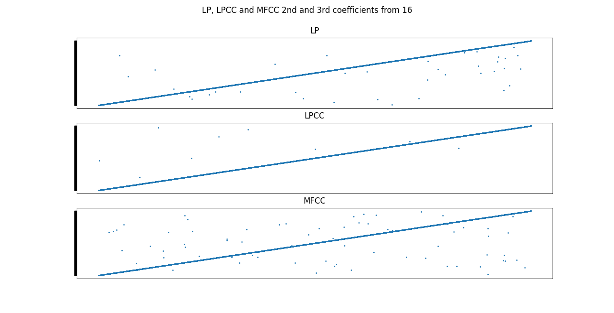

PAV - P4: reconocimiento y verificación del locutor
===================================================

Obtenga su copia del repositorio de la práctica accediendo a [Práctica 4](https://github.com/albino-pav/P4)
y pulsando sobre el botón `Fork` situado en la esquina superior derecha. A continuación, siga las
instrucciones de la [Práctica 2](https://github.com/albino-pav/P2) para crear una rama con el apellido de
los integrantes del grupo de prácticas, dar de alta al resto de integrantes como colaboradores del proyecto
y crear la copias locales del repositorio.

También debe descomprimir, en el directorio `PAV/P4`, el fichero [db_8mu.tgz](https://atenea.upc.edu/pluginfile.php/3145524/mod_assign/introattachment/0/spk_8mu.tgz?forcedownload=1)
con la base de datos oral que se utilizará en la parte experimental de la práctica.

Como entrega deberá realizar un *pull request* con el contenido de su copia del repositorio. Recuerde
que los ficheros entregados deberán estar en condiciones de ser ejecutados con sólo ejecutar:

~~~~~~~~~~~~~~~~~~~~~~~~~~~~~~~~~~~~~~~~~~~~~~~~~~~~~.sh
  make release
  run_spkid mfcc train test classerr verify verifyerr
~~~~~~~~~~~~~~~~~~~~~~~~~~~~~~~~~~~~~~~~~~~~~~~~~~~~~

Recuerde que, además de los trabajos indicados en esta parte básica, también deberá realizar un proyecto
de ampliación, del cual deberá subir una memoria explicativa a Atenea y los ficheros correspondientes al
repositorio de la práctica.

A modo de memoria de la parte básica, complete, en este mismo documento y usando el formato *markdown*, los
ejercicios indicados.

## Ejercicios.

### SPTK, Sox y los scripts de extracción de características.

- Analice el script `wav2lp.sh` y explique la misión de los distintos comandos involucrados en el *pipeline*
  principal (`sox`, `$X2X`, `$FRAME`, `$WINDOW` y `$LPC`). Explique el significado de cada una de las 
  opciones empleadas y de sus valores.
  - 'sox': convierte las señales codificadas en ley mu de 8 bits a señales raw de 16 bits con signo.
  - '$X2X': convierte la señal de short a float.
  - '$FRAME': separa la señal en tramos de 240 muestras y separación de 80 muestras.
  - '$WINDOW': enventana la señal de entrado con ventanas de 240 muestras y la convierte en una señal de salida con frames de 240 muestras.
  - '$LPC': devuelve la ganancia de la predicción lineal más el número indicado de coeficientes, a partir de la señal de entrada.

- Explique el procedimiento seguido para obtener un fichero de formato *fmatrix* a partir de los ficheros de
  salida de SPTK (líneas 45 a 47 del script `wav2lp.sh`).

    Se elige como número de columnas el número de coeficientes de salida del SPTK, y el numero de filas como el número de tramas. La variable `nrow` lee todas las líneas del fichero que contiene los coeficientes y los almacena línea por línea en formato ascii. Finalmente, convierte el conjunto `ncol` y `nrow` a enteros sin signo de 4 bytes y los añade al fichero de salida, concatenando después el fichero de coeficientes sin cambio de formato.

  * ¿Por qué es conveniente usar este formato (u otro parecido)? Tenga en cuenta cuál es el formato de
    entrada y cuál es el de resultado.

      Pasamos de una señal de voz codificada con ley mu de 8 bits a un listado de p coeficientes para cada trama, sacados de una señal raw de 16 bits con signo. Es conveniente usar este formato ya que, a nivel matemático y de programación, nos es muy útil tener los coeficientes ordenados por segmentos, en forma de matriz. Es útil tener coeficientes en vez de señales ya que sintetizan las particularidades del narrador en pocos valores.

- Escriba el *pipeline* principal usado para calcular los coeficientes cepstrales de predicción lineal
  (LPCC) en su fichero <code>scripts/wav2lpcc.sh</code>:

    ```bash
     sox $inputfile -t raw -e signed -b 16 - | $X2X +sf | $FRAME -l 240 -p 80 | $WINDOW -l 240 -L 240 | $LPC -l 240 -m $lpc_order | $LPCC -m $lpc_order -M $cepstrum_order > $base.lpcc
     ```

- Escriba el *pipeline* principal usado para calcular los coeficientes cepstrales en escala Mel (MFCC) en su
  fichero <code>scripts/wav2mfcc.sh</code>:

    ```bash
     sox $inputfile -t raw -e signed -b 16 - | $X2X +sf | $FRAME -l 240 -p 80 | $WINDOW -l 240 -L 240 | $LPC -l 240 -m $lpc_order | $MFCC -m $mfcc_order -l 240 > $base.mfcc
     ```

### Extracción de características.

- Inserte una imagen mostrando la dependencia entre los coeficientes 2 y 3 de las tres parametrizaciones
  para todas las señales de un locutor.

    - Locutor 16

      

    - Locutor 17
    
      
  
  + Indique **todas** las órdenes necesarias para obtener las gráficas a partir de las señales 
    parametrizadas.
    
    Para obtener los ficheros con los coeficientes, en el terminal:
    ```bash
    fmatrix_show work/lp/BLOCK01/SES016/*.lp | egrep '^\[' | cut -f2,3 > lp16_2_3.txt
    fmatrix_show work/lpcc/BLOCK01/SES016/*.lpcc | egrep '^\[' | cut -f2,3 > lpcc16_2_3.txt
    fmatrix_show work/mfcc/BLOCK01/SES016/*.mfcc | egrep '^\[' | cut -f2,3 > mfcc16_2_3.txt
    fmatrix_show work/lp/BLOCK01/SES017/*.lp | egrep '^\[' | cut -f2,3 > lp17_2_3.txt
    fmatrix_show work/lpcc/BLOCK01/SES017/*.lpcc | egrep '^\[' | cut -f2,3 > lpcc17_2_3.txt
    fmatrix_show work/mfcc/BLOCK01/SES017/*.mfcc | egrep '^\[' | cut -f2,3 > mfcc17_2_3.txt
    ```

    Para obtener las gráficas:
      - Script `graphs.py`: lee ficheros, guarda columnas, hace *scatter* de un coeficiente contra el otro, para todos los coeficientes y todas las parametrizaciones.

  + ¿Cuál de ellas le parece que contiene más información?

    La que parece contener más información es la parametrización *MFCC*, ya que es la que da coeficientes más incorrelados, eso es, con un coeficiente es difícil predecir el siguiente.

- Usando el programa <code>pearson</code>, obtenga los coeficientes de correlación normalizada entre los
  parámetros 2 y 3 para un locutor, y rellene la tabla siguiente con los valores obtenidos.

  Con el objetivo de poder relacionar mejor los resultados usando pearson.cpp con los resultados gráficos, hemos calculado los coeficientes de correlación normalizada del locutor SES024: 
  ```bash
  pearson -N work/lp/BLOCK02/SES024/SA024S*
  pearson -N work/lpcc/BLOCK02/SES024/SA024S*
  pearson -N work/mfcc/BLOCK02/SES024/SA024S*

  ```

  |                        | LP   | LPCC | MFCC |
  |------------------------|:----:|:----:|:----:|
  | &rho;<sub>x</sub>[2,3] |  -0.657444  |   0.125695   |   0.100235   |
  
  + Compare los resultados de <code>pearson</code> con los obtenidos gráficamente.

  Vemos que, igual que pasaba en las gráficas, la mayor dispersión que mostraban los coeficientes MFCC gráficamente, se ha traducido en un valor de correlación más cercano a 0 (baja correlación).
  
- Según la teoría, ¿qué parámetros considera adecuados para el cálculo de los coeficientes LPCC y MFCC?
  - LPCC: 12 coeficientes de LPC y 12 de ceptsrum.
  - MFCC: 12 coeficientes.

### Entrenamiento y visualización de los GMM.

Complete el código necesario para entrenar modelos GMM.

- Inserte una gráfica que muestre la función de densidad de probabilidad modelada por el GMM de un locutor
  para sus dos primeros coeficientes de MFCC.

    
  
- Inserte una gráfica que permita comparar los modelos y poblaciones de dos locutores distintos (la gŕafica
  de la página 20 del enunciado puede servirle de referencia del resultado deseado). Analice la capacidad
  del modelado GMM para diferenciar las señales de uno y otro.

    ```bash
    plot_gmm_feat work/gmm/mfcc/SES017.gmm work/mfcc/BLOCK10/SES100/SA100S*
    ```

    

    Lo primero que podemos destacar es que la capacidad del GMM varía mucho con el número de gaussianas que se usan, pero de este factor también depende el tiempo de ejecución. También es importante la elección de los parámetros que se modelan, ya que unos parámetros muy correlados nos darán funciones de densidad muy correladas para diferentes locutores, y lo que queremos son densidades de probabilidad bien diferenciadas para mejorar la detección.

### Reconocimiento del locutor.

Complete el código necesario para realizar reconociminto del locutor y optimice sus parámetros.

- Inserte una tabla con la tasa de error obtenida en el reconocimiento de los locutores de la base de datos
  SPEECON usando su mejor sistema de reconocimiento para los parámetros LP, LPCC y MFCC.

    | Parametrización |   LP   |  LPCC   |  MFCC  |
    |-----------------|:------:|:-------:|:------:|
    | Error           | 9,81 % | 12,36 % | 1,02 % |

### Verificación del locutor.

Complete el código necesario para realizar verificación del locutor y optimice sus parámetros.

- Inserte una tabla con el *score* obtenido con su mejor sistema de verificación del locutor en la tarea
  de verificación de SPEECON. La tabla debe incluir el umbral óptimo, el número de falsas alarmas y de
  pérdidas, y el score obtenido usando la parametrización que mejor resultado le hubiera dado en la tarea
  de reconocimiento.
 
### Test final

- Adjunte, en el repositorio de la práctica, los ficheros `class_test.log` y `verif_test.log` 
  correspondientes a la evaluación *ciega* final.

### Trabajo de ampliación.

- Recuerde enviar a Atenea un fichero en formato zip o tgz con la memoria (en formato PDF) con el trabajo 
  realizado como ampliación, así como los ficheros `class_ampl.log` y/o `verif_ampl.log`, obtenidos como 
  resultado del mismo.
