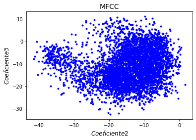

PAV - P4: reconocimiento y verificación del locutor
===================================================

Obtenga su copia del repositorio de la práctica accediendo a [Práctica 4](https://github.com/albino-pav/P4)
y pulsando sobre el botón `Fork` situado en la esquina superior derecha. A continuación, siga las
instrucciones de la [Práctica 2](https://github.com/albino-pav/P2) para crear una rama con el apellido de
los integrantes del grupo de prácticas, dar de alta al resto de integrantes como colaboradores del proyecto
y crear la copias locales del repositorio.

También debe descomprimir, en el directorio `PAV/P4`, el fichero [db_8mu.tgz](https://atenea.upc.edu/pluginfile.php/3145524/mod_assign/introattachment/0/spk_8mu.tgz?forcedownload=1)
con la base de datos oral que se utilizará en la parte experimental de la práctica.

Como entrega deberá realizar un *pull request* con el contenido de su copia del repositorio. Recuerde
que los ficheros entregados deberán estar en condiciones de ser ejecutados con sólo ejecutar:

~~~~~~~~~~~~~~~~~~~~~~~~~~~~~~~~~~~~~~~~~~~~~~~~~~~~~.sh
  make release
  run_spkid mfcc train test classerr verify verifyerr
~~~~~~~~~~~~~~~~~~~~~~~~~~~~~~~~~~~~~~~~~~~~~~~~~~~~~

Recuerde que, además de los trabajos indicados en esta parte básica, también deberá realizar un proyecto
de ampliación, del cual deberá subir una memoria explicativa a Atenea y los ficheros correspondientes al
repositorio de la práctica.

A modo de memoria de la parte básica, complete, en este mismo documento y usando el formato *markdown*, los
ejercicios indicados.

## Ejercicios.

### SPTK, Sox y los scripts de extracción de características.

- Analice el script `wav2lp.sh` y explique la misión de los distintos comandos involucrados en el *pipeline*
  principal (`sox`, `$X2X`, `$FRAME`, `$WINDOW` y `$LPC`). Explique el significado de cada una de las 
  opciones empleadas y de sus valores.
  >
  > ~~~~~~~~~~~~~~~~~~~~~~~~~~~~~~~~~~~~~~~~~~~~~~~~~~~~~~~~~~~~~~~~~~~~~~~~~~.sh
  > sox $inputfile -t raw -e signed -b 16 - | $X2X +sf | $FRAME -l 240 -p 80 |
  >   $WINDOW -l 240 -L 240 | $LPC -l 240 -m $lpc_order > $base.lp
  > ~~~~~~~~~~~~~~~~~~~~~~~~~~~~~~~~~~~~~~~~~~~~~~~~~~~~~~~~~~~~~~~~~~~~~~~~~~
  >
  > - `sox`: aplicación para cambiar el formato de un archivo de audio, cambiar su codificación, frecuencia de muestreo, aplicar filtros a la señal que contiene. En este caso, se ha transformado el fichero de entrada, que es raw, a uno de enteros con signo (signed-integer) de 16 bits por muestra a través de las opciones `-t`, `-e` y `-b`.
  >
  >   * `-t`: Indica el tipo de fichero de audio de entrada. En este caso, raw.
  >   * `-e`: Indica el tipo de codificación que se le aplica al fichero de entrada. En este caso, signed-integer.
  >   * `-b`: Indica el número de bits por muestra que se utilizan en la codificación. En este caso, 16 bits, es decir, 2 bytes.
  >
  > - `$X2X`: transforma el tipo de los datos. En este caso, se usa una conversión de 2 bytes (short, opción `+s`) a 4 bytes (float, opción `+f`). 
  >
  > - `$FRAME`: separa la secuencia de datos de un archivo en tramas distintas. En este caso, separa las muestras en segmentos de 240 muestras (tamaño de trama, opción `-l`) con un desplazamiento entre tramas de 80 muestras (desplazamiento entre tramas, opción `-p`).
  >
  > - `$WINDOW`: enventana una trama de datos. En este caso, el tamaño de ventana de la señal input es de 240 muestras (opción `-l`) como se ha establecido en el comando anterior y el tamaño de ventana de salida queremos que sea el mismo (opción `-L`). Como no se mofician los parámetros `-n`y `-w`, por defecto, se aplicará una normalización de la potencia y el tipo de ventana será Blackman. Se adjunta una imagen donde se muestra la forma de la ventana Blackman.
  >
  > 
  >
  > - `$LPC`: calcula los coeficientes de predicción lineal. Con la opción `-l`se establece el tamaño de las tramas (en este caso, debe ser 240 muestras por los comandos anteriores) y con la ocpión `-m` el usuario podrá decidir el orden del LPC.

- Explique el procedimiento seguido para obtener un fichero de formato *fmatrix* a partir de los ficheros de
  salida de SPTK (líneas 45 a 47 del script `wav2lp.sh`).
  >
  > ~~~~~~~~~~~~~~~~~~~~~~~~~~~~~~~~~~~~~~~~~~~~~~~~~~~~~~~~~~~~~~~~~~~~~~~~.sh
  > ncol=$((lpc_order+1)) # lpc p =>  (gain a1 a2 ... ap) 
  > nrow=`$X2X +fa < $base.lp | wc -l | perl -ne 'print $_/'$ncol', "\n";'`
  > ~~~~~~~~~~~~~~~~~~~~~~~~~~~~~~~~~~~~~~~~~~~~~~~~~~~~~~~~~~~~~~~~~~~~~~~~
  >
  > En la primera línea, se especifica el número de columnas que tendrá la matriz. En este script debe ser el orden de los coeficientes de prediccón lineal más uno ya que también se tiene que tener en cuenta la ganancia, que es el primer elemento. De esta forma, los coeficientes de cada fichero de cada audio estarán en una fila diferente.
  > En la segunda línea, se transforma el contenido del fichero temporal `$base.lp` de **float** a **ASCII** para poder visualizar los datos. El comando `wc -l` cuenta el número de líneas del fichero temporal transformado a ASCII y de esta forma obtenemos el número de filas que debe tener el fichero resultante. El comando `perl -ne` imprime los valores con un salto de línea.

  * ¿Por qué es conveniente usar este formato (u otro parecido)? Tenga en cuenta cuál es el formato de
    entrada y cuál es el de resultado.
    >
    > Es más útil tener los datos guardados siguiendo un orden y con espacios determinados a que estén todos juntos. 
    > Por ejemplo, si se quiere observar los coeficientes del audio número N, tan solo hay que buscar los coeficientes en la línea N en vez de ponerse a contar cuántos coeficientes se han leído hasta el momento.

- Escriba el *pipeline* principal usado para calcular los coeficientes cepstrales de predicción lineal
  (LPCC) en su fichero <code>scripts/wav2lpcc.sh</code>:
  >
  > ~~~~~~~~~~~~~~~~~~~~~~~~~~~~~~~~~~~~~~~~~~~~~~~~~~~~~~~~~~~~~~~~~~~~~~~~~~~~~~~~~~~~~~~~~~~~~~~~~~.sh
  > sox $inputfile -t raw -e signed -b 16 - | $X2X +sf | $FRAME -l 240 -p 80 | $WINDOW -l 240 -L 240 |
	>   $LPC -l 240 -m $lpc_order | $LPC2C -m $lpc_order -M $lpcc_order > $base.lpcc
  > ~~~~~~~~~~~~~~~~~~~~~~~~~~~~~~~~~~~~~~~~~~~~~~~~~~~~~~~~~~~~~~~~~~~~~~~~~~~~~~~~~~~~~~~~~~~~~~~~~~
  >
  > Se han mantenido los comandos de `wav2lp.sh` y se ha añadido la función `$LPC2C`, que convierte los coeficientes LPC a LPCC, implementada con las opciones `-m`(se especifica el orden de los coeficientes LPC de entrada) y `-M`(se especifica el orden de los coeficientes LPCC de salida).

- Escriba el *pipeline* principal usado para calcular los coeficientes cepstrales en escala Mel (MFCC) en su
  fichero <code>scripts/wav2mfcc.sh</code>:
  >
  > ~~~~~~~~~~~~~~~~~~~~~~~~~~~~~~~~~~~~~~~~~~~~~~~~~~~~~~~~~~~~~~~~~~~~~~~~~~~~~~~~~~~~~~~~~~~~~~~~~~.sh
  > sox $inputfile -t raw -e signed -b 16 - | $X2X +sf | $FRAME -l 240 -p 80 | $WINDOW -l 240 -L 240 |
	>   $MFCC -s $sampling_freq -l 240 -m $mfcc_order -n $melbank_order > $base.mfcc
  > ~~~~~~~~~~~~~~~~~~~~~~~~~~~~~~~~~~~~~~~~~~~~~~~~~~~~~~~~~~~~~~~~~~~~~~~~~~~~~~~~~~~~~~~~~~~~~~~~~~
  >
  > Se han mantenido los comandos de `wav2lp.sh` (menos el comando `$LPC`) y se ha añadido la función `$MFCC`, que calcula los coeficientes MFCC, implementada con las opciones `-s` (la frecuencia de muestreo), `-l` (la longitud de la trama), `-m` (el orden de los coeficientes MFCC) y `-n` (la cantidad de filtros Mel usados).

### Extracción de características.

- Inserte una imagen mostrando la dependencia entre los coeficientes 2 y 3 de las tres parametrizaciones
  para todas las señales de un locutor.
  >
  > Las gráficas con los coeficientes 2 y 3 de la sesión 226:
  >
  > 
  >
  > 
  >
  > 
  >
  > Podemos ver que el orden de más a menos correlado es: LPC, LPCC y MFCC. Esto se puede comprobar con la distribución de las gráficas. Por ejemplo, en LPC los puntos de la gráfica siguen una distribución lineal de forma que con un parámetro obtenemos el otro. En cambio, en MFCC no parecen forman ninguna distribución en concreto con lo que los dos parámetros aportan información.
  
  + Indique **todas** las órdenes necesarias para obtener las gráficas a partir de las señales 
    parametrizadas.
    >
    > Usando los comandos siguientes en el terminal obtenemos un fichero con los valores a representar (también se ha recortado el fichero output para poder representar en Python las gráficas):
    >
    > ~~~~~~~~~~~~~~~~~~~~~~~~~~~~~~~~~~~~~~~~~~~~~~~~~~~~~~~~~~~~~~~~~~~~~~~~~~~~~~~~~~~~~~~~~~~~~~~~~~.sh
    >  fmatrix_show work/lp/BLOCK22/SES226/*.lp | egrep '^\[' | cut -f2,3 > lp_2_3.txt
    >  fmatrix_show work/lpcc/BLOCK22/SES226/*.lpcc | egrep '^\[' | cut -f2,3 > lpcc_2_3.txt
    >  fmatrix_show work/mfcc/BLOCK22/SES226/*.mfcc | egrep '^\[' | cut -f2,3 > mfcc_2_3.txt
    > ~~~~~~~~~~~~~~~~~~~~~~~~~~~~~~~~~~~~~~~~~~~~~~~~~~~~~~~~~~~~~~~~~~~~~~~~~~~~~~~~~~~~~~~~~~~~~~~~~~
    >
    > Cógido de Python usado:
    > ~~~~~~~~~~~~~~~~~~~~~~~~~~~~~~~~~~~~~~~~~~~~~~~~~~~~~~~~~~~~~~~~~~~~~~~~~~~~~~~~~~~~~~~~~~~~~~~~~~.py
    >  # Imports necessarios
    >  import numpy as np
    >  import matplotlib as mpl
    >  import matplotlib.pyplot as plt
    >
    >  # Abrir los ficheros
    >  lp_filename = 'lp_2_3.txt'
    >  lpcc_filename = 'lpcc_2_3.txt'
    >  mfcc_filename = 'mfcc_2_3.txt'
    >  lp = np.loadtxt(lp_filename, delimiter='\t', skiprows=0,)
    >  lpcc = np.loadtxt(lpcc_filename, delimiter='\t', skiprows=0,)
    >  mfcc = np.loadtxt(mfcc_filename, delimiter='\t', skiprows=0,)
    >
    >  # Mostrar los coeficientes LPC
    >  plt.plot(lp[:,0], lp[:,1],'b.')
    >  plt.xlabel("$Coeficiente 2$", fontsize=12)
    >  plt.ylabel("$Coeficiente 3$", fontsize=12)
    >  plt.title("LPC", fontsize=14)
    >  plt.show()
    >
    >  # Mostrar los coeficientes LPCC
    >  plt.plot(lpcc[:,0], lpcc[:,1],'b.')
    >  plt.xlabel("$Coeficiente 2$", fontsize=12)
    >  plt.ylabel("$Coeficiente 3$", fontsize=12)
    >  plt.title("LPCC", fontsize=14)
    >  plt.show()
    >
    >  # Mostrar los coeficientes MFCC
    >  plt.plot(mfcc[:,0], mfcc[:,1],'b.')
    >  plt.xlabel("$Coeficiente 2$", fontsize=12)
    >  plt.ylabel("$Coeficiente 3$", fontsize=12)
    >  plt.title("MFCC", fontsize=14)
    >  plt.show()
    > ~~~~~~~~~~~~~~~~~~~~~~~~~~~~~~~~~~~~~~~~~~~~~~~~~~~~~~~~~~~~~~~~~~~~~~~~~~~~~~~~~~~~~~~~~~~~~~~~~~

  + ¿Cuál de ellas le parece que contiene más información?
  >
  > La que contiene más información es la MFCC ya que, como se ha comentado anteriormente, sus parámetros no están tan correlados como las otras dos parametrizaciones.

- Usando el programa <code>pearson</code>, obtenga los coeficientes de correlación normalizada entre los
  parámetros 2 y 3 para un locutor, y rellene la tabla siguiente con los valores obtenidos.

  |                        |       LP      |     LPCC     |      MFCC    |
  |------------------------|:-------------:|:------------:|:------------:|
  | &rho;x[2,3] |   -0.634368   |   0.218288   |   0.010362   |
  
  + Compare los resultados de <code>pearson</code> con los obtenidos gráficamente.
  >
  > Podemos comprobar que el coeficiente de correlación normalizada es mayor, en valor absoluto, para la parametrización LPC (tiene una distribución lineal) y menor para MFCC (no tiene ninguna distribución aparentemente). Esto se corresponde con los resultados mencionados anteriormente.
  
- Según la teoría, ¿qué parámetros considera adecuados para el cálculo de los coeficientes LPCC y MFCC?
  >
  > El orden de los coeficientes LPCC debería ser alrededor de 12 y el de los coeficientes LPC que se usan para calcular los LPCC, 8. En MFCC, se deberían usar entre 24 y 40 filtros Mel (hemos usado 30) y el orden de los coeficientes debería ser 13.

### Entrenamiento y visualización de los GMM.

Complete el código necesario para entrenar modelos GMM.

- Inserte una gráfica que muestre la función de densidad de probabilidad modelada por el GMM de un locutor
  para sus dos primeros coeficientes de MFCC.
  >
  > Usando 60 gaussianas con 90 iteraciones, un umbral de probabilidad de 0.0001 y una inicialización con VQ, obtenemos la siguiente función de densidad de probabilidad para el locutor 226:
  >
  > 
  
- Inserte una gráfica que permita comparar los modelos y poblaciones de dos locutores distintos (la gŕafica
  de la página 20 del enunciado puede servirle de referencia del resultado deseado). Analice la capacidad
  del modelado GMM para diferenciar las señales de uno y otro.
  >
  > Podemos observar que ambas funciones de probabilidad se concentran en la misma zona pero las formas de las gaussianas bidimensionales (y de los percentiles) son suficientemente diferentes como para poder distinguir ambos locutores. En este caso, el percentil 50% del locutor 226 es más extenso que el del 064.
  >
  > 

### Reconocimiento del locutor.

Complete el código necesario para realizar reconociminto del locutor y optimice sus parámetros.

- Inserte una tabla con la tasa de error obtenida en el reconocimiento de los locutores de la base de datos
  SPEECON usando su mejor sistema de reconocimiento para los parámetros LP, LPCC y MFCC.

  |                 |       LP      |     LPCC     |      MFCC    |
  |-----------------|:-------------:|:------------:|:------------:|
  | Tasa de errores |               |              |              |

### Verificación del locutor.

Complete el código necesario para realizar verificación del locutor y optimice sus parámetros.

- Inserte una tabla con el *score* obtenido con su mejor sistema de verificación del locutor en la tarea
  de verificación de SPEECON. La tabla debe incluir el umbral óptimo, el número de falsas alarmas y de
  pérdidas, y el score obtenido usando la parametrización que mejor resultado le hubiera dado en la tarea
  de reconocimiento.

  |                     |       LP      |     LPCC     | MFCC (verificación) | MFCC (reconocimiento) |
  |---------------------|:-------------:|:------------:|:-------------------:|:---------------------:|
  | Umbral óptimo       |               |              |                     |                       |
  |---------------------|:-------------:|:------------:|:-------------------:|:---------------------:|
  | Núm. falsas alarmas |               |              |                     |                       |
  |---------------------|:-------------:|:------------:|:-------------------:|:---------------------:|
  | Núm. pérdidas       |               |              |                     |                       |
  |---------------------|:-------------:|:------------:|:-------------------:|:---------------------:|
  | Coste de detección  |               |              |                     |                       |
 
### Test final

- Adjunte, en el repositorio de la práctica, los ficheros `class_test.log` y `verif_test.log` 
  correspondientes a la evaluación *ciega* final.

### Trabajo de ampliación.

- Recuerde enviar a Atenea un fichero en formato zip o tgz con la memoria (en formato PDF) con el trabajo 
  realizado como ampliación, así como los ficheros `class_ampl.log` y/o `verif_ampl.log`, obtenidos como 
  resultado del mismo.
